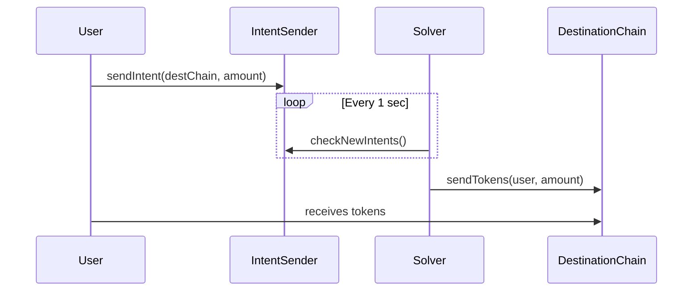

```markdown
# Liberichain Solver (Cross-Chain Open Intents)

Minimal solver for Liberichain’s Open Intents system, supporting cross-chain swaps via Hyperlane on Arbitrum Nitro & Espresso Systems.

## 📂 Folder Structure
```
solver/
├── contract/
│   ├── ERC20.json
│   ├── IntentSender.json       # For cross-chain intent submission
├── src/
│   ├── config.ts              # Chain configurations
│   ├── index.ts               # Main solver logic
│   └── types.ts
├── .env.example
└── package.json
## 🌉 Cross-Chain Workflow

1. **User Submits Intent**  
   - Calls `IntentSender.sendIntent()` on the source chain (e.g., Arbitrum Sepolia).

2. **Solver Monitors**  
   - Polls the `IntentSender` contract every second for new intents.

3. **Token Bridging**  
   - Solver sends equivalent tokens to the user on the destination chain via Hyperlane-wrapped assets.

4. **User Receives Funds**  
   - Tokens arrive on the destination chain (gas paid by the solver).




## ⚙️ Pre-Requirements
1. **Token Deployment**  
   - ERC20 tokens must be deployed on all chains and wrapped via Hyperlane.
2. **Chain Setup**  
   - Hyperlane configured for:
     - Arbitrum Nitro (Sepolia)
     - Espresso Systems (Testnet)
3. **Tech Stack**  
   ```bash
   yarn add typescript ts-node ethers viem dotenv
   ```

## 🔄 Open Intents Logic
- **Single Transaction**:  
  ```ts
  // User intent example
  await IntentSender.sendIntent({
    destChain: '1614990', //liberichain chain id
    token: 'USDC',
    amount: '100'
  });
  ```
- **Net Settlement**:  
  If 2 users swap USDC between chains:
  - Only the **difference** is settled on-chain (e.g., 100 USDC in → 80 USDC out = 20 USDC net transfer).

## 🛠️ Setup
1. Configure `.env`:
   ```ini
  SOURCE_CHAIN_RPC_URL = 
  DEST_CHAIN_RPC_URL = 
  SOLVER_PRIVATE_KEY = 
  INTENT_SENDER_CONTRACT_ADDRESS =
  USER_PRIVATE_KEY = 
  USER_ADDRESS =
  SOURCE_TOKEN_ADDRESS =
  DESTINATION_TOKEN_ADDRESS =
   ```
2. Run:
   ```bash
   yarn install
   yarn ts-node src/solver.ts
   yarn ts-node src/transaction.ts
   ```
3. Debugging

## ⚠️ Limitations
- Requires pre-funded solver wallets on all chains.
- Has a testnet balance

---
[Liberichain Contracts](https://github.com/novaria-defi/liberichain-open-intents) | [Hyperlane Docs](https://docs.hyperlane.xyz)
```
